# studyJava
- Java面试集训营-找准程序员的【涨薪方向】：http://t.kuick.cn/RaCF
- 资深HR亲授-简历投递和薪资谈判技巧：http://t.kuick.cn/RaCL
- 如何设计高可用的微服务架构：http://t.kuick.cn/Ra1c
- 如何构建普适的业务中台架构：http://t.kuick.cn/Ra1I
- 基于大中台小前台模式设计高并发电商架构：http://t.kuick.cn/Ra1b
- 深入分析分布式事务的原理及特性：http://t.kuick.cn/Ra1m
- Dubbo微服务之负载均衡算法原理分析：http://t.kuick.cn/Raxq
- Dubbo微服务之服务治理算法原理分析：http://t.kuick.cn/RaxS
- 詹哥带你打造最稳的JVM知识图谱：http://t.kuick.cn/RaC8
## java 数据类型  
    分为基本类型和引用类型,
    其中基本数据类型有八种,
    整数类型(byte,short,int,long),
    浮点(单精度float,双精度double)
    字符类型(char),
    布尔类型(Boolean),
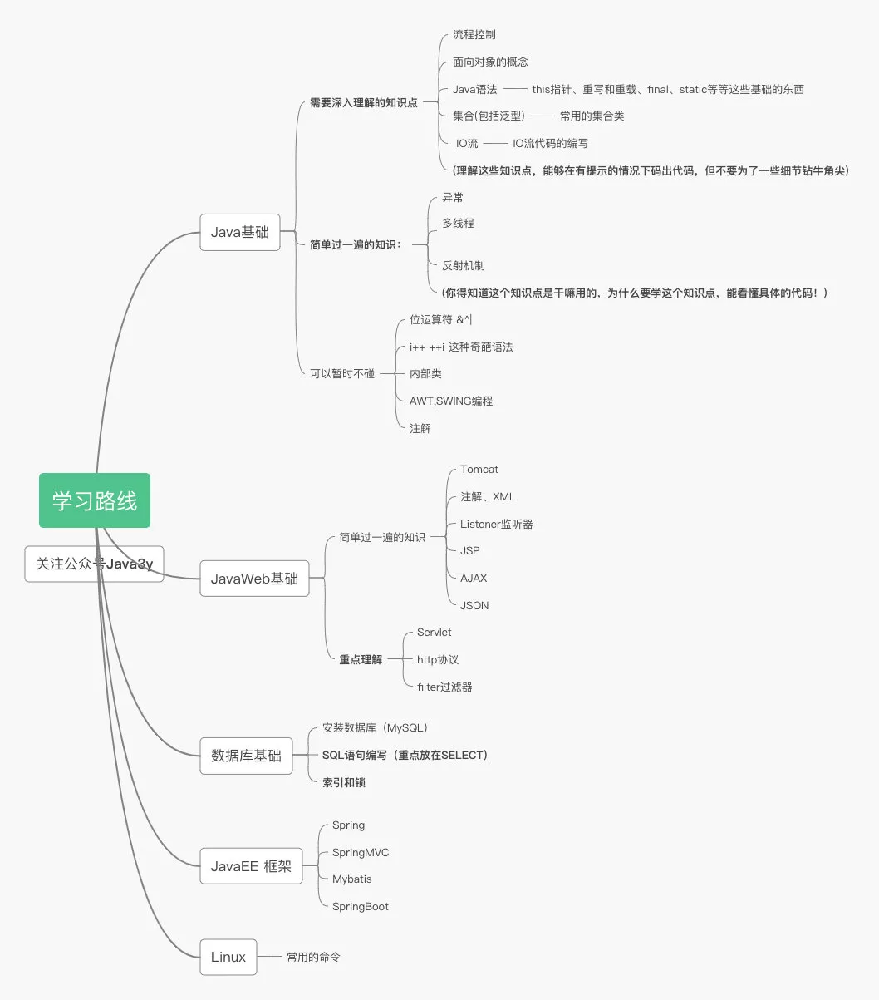

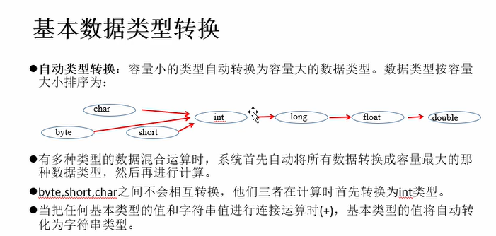
```
引用类型 可用null作为值 初始化可为null 值不可变类 int a = 1 int b  =1 内存中存在两个1得值 String s1 = "Hello" String s2 = "Hello" 不会再内存中存在两个hello 只存在一个hello
```
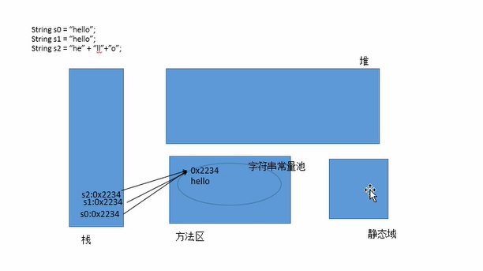

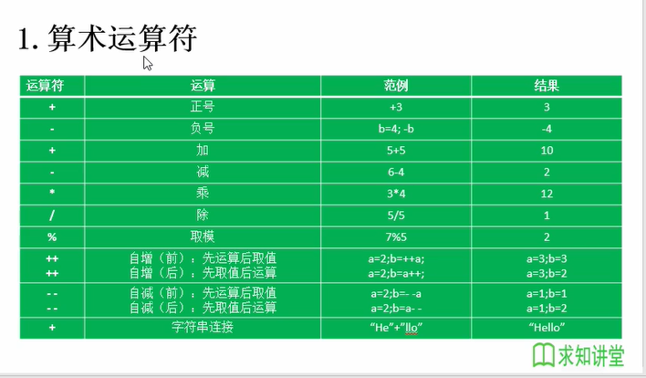

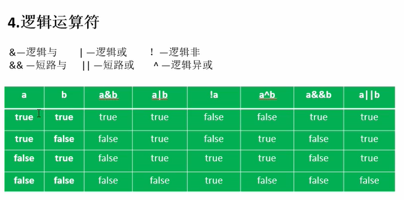

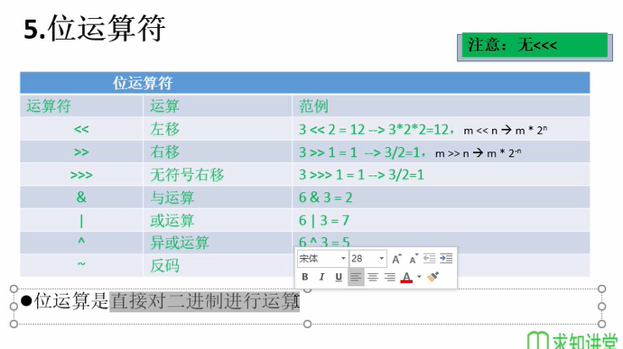

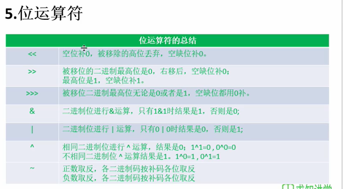

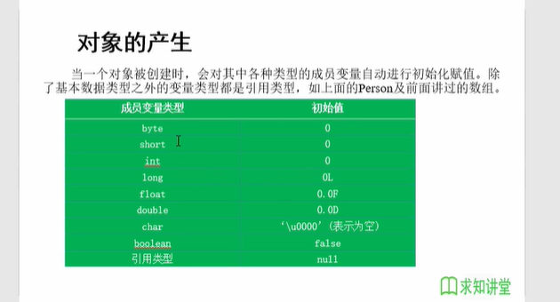

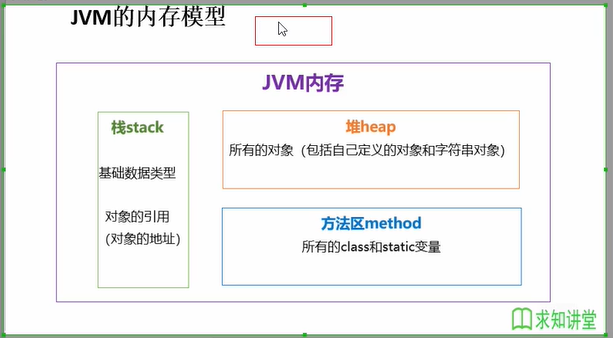
```
//栈(stack)基础数据的类型 对象的引用(对象的地址)
//堆(heap)所以的对象(包括自己定义的对象和字符串对象)
//方法区(method) 所有的class和static的变量
//基础数据类型,值在栈中,引用对象,值保存在堆中,栈中存的是对象在堆中的地址
//引用传值
//传递的是对象在堆中的地址,所以ds ds1 栈中存储都最终指向堆中地址
```
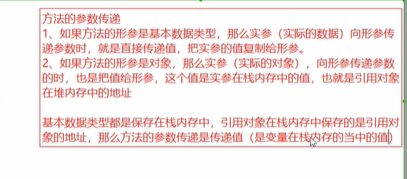
## java 包
```
在java中包的概念和文件夹的概念相似,同样,包的存在也是为了解决(文科太乱不好管理和文件同名问题)
```
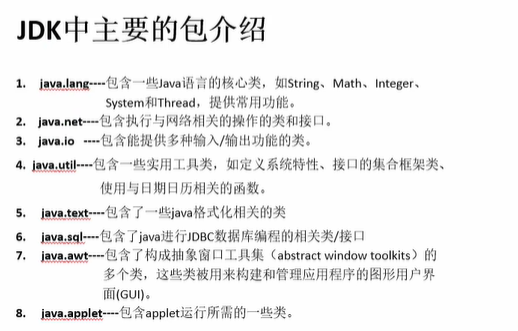
## 封装与隐藏
```
把属性设置为私有 通过编写公共的方法(set get)来进行操作
```
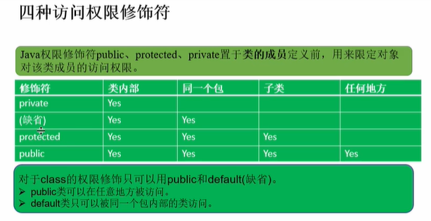
```
同一个java文件中可以有多个class 但是只能有一个public在同一个class中的调用顺序(调用范围)
```
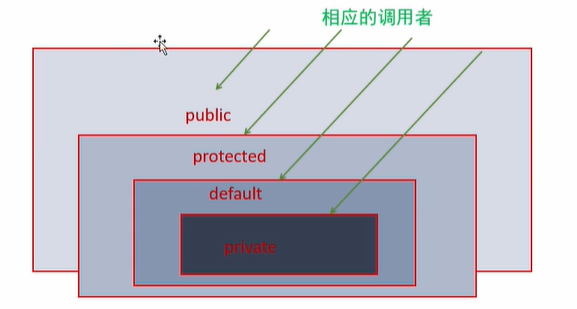

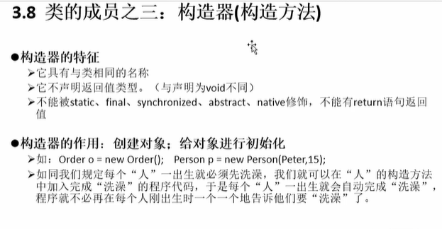
```
默认的构造方法 前面有没有访问的修饰符和类的有关, public 就是public 缺省就是缺省
```
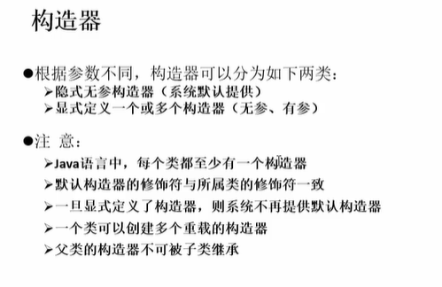
```
new 对象实际就是调用构造方法
```
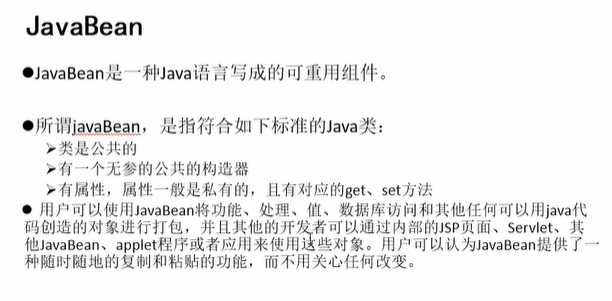

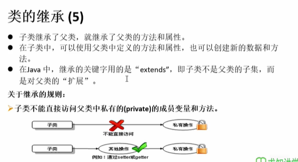

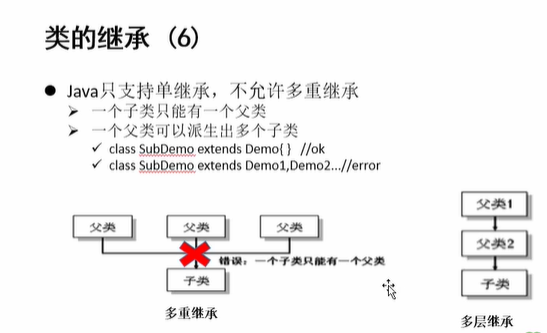

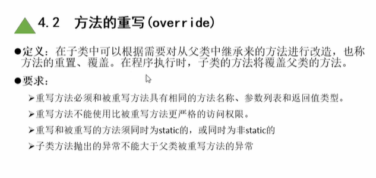