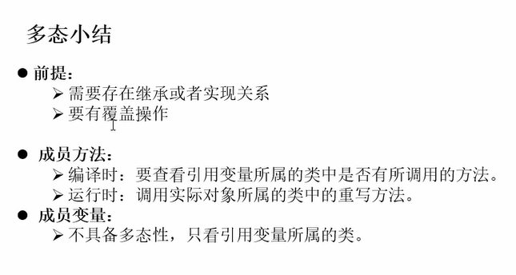
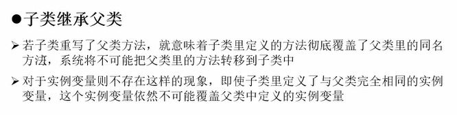

# studyJava
- Java面试集训营-找准程序员的【涨薪方向】：http://t.kuick.cn/RaCF
- 资深HR亲授-简历投递和薪资谈判技巧：http://t.kuick.cn/RaCL
- 如何设计高可用的微服务架构：http://t.kuick.cn/Ra1c
- 如何构建普适的业务中台架构：http://t.kuick.cn/Ra1I
- 基于大中台小前台模式设计高并发电商架构：http://t.kuick.cn/Ra1b
- 深入分析分布式事务的原理及特性：http://t.kuick.cn/Ra1m
- Dubbo微服务之负载均衡算法原理分析：http://t.kuick.cn/Raxq
- Dubbo微服务之服务治理算法原理分析：http://t.kuick.cn/RaxS
- 詹哥带你打造最稳的JVM知识图谱：http://t.kuick.cn/RaC8
### Java 语言目前定义了 51 个关键字，这些关键字不能作为变量名、类名和方法名来使用。以下对这些关键字进行了分类。
    数据类型：boolean、int、long、short、byte、float、double、char、class、interface。
    流程控制：if、else、do、while、for、switch、case、default、break、continue、return、try、catch、finally。
    修饰符：public、protected、private、final、void、static、strict、abstract、transient、synchronized、volatile、native。
    动作：package、import、throw、throws、extends、implements、this、supper、instanceof、new。
    保留字：true、false、null、goto、const。
## java 数据类型  
    分为基本类型和引用类型,
    其中基本数据类型有八种,
    整数类型(byte,short,int,long),
    浮点(单精度float,双精度double)
    字符类型(char),
    布尔类型(Boolean),
### javadoc   
    标签	描述	示例
    @author	标识一个类的作者，一般用于类注释	@author description
    @deprecated	指名一个过期的类或成员，表明该类或方法不建议使用	@deprecated description
    {@docRoot}	指明当前文档根目录的路径	Directory Path
    @exception	可能抛出异常的说明，一般用于方法注释	@exception exception-name explanation
    {@inheritDoc}	从直接父类继承的注释	Inherits a comment from the immediate surperclass.
    {@link}	插入一个到另一个主题的链接	{@link name text}
    {@linkplain}	插入一个到另一个主题的链接，但是该链接显示纯文本字体	Inserts an in-line link to another topic.
    @param	说明一个方法的参数，一般用于方法注释	@param parameter-name explanation
    @return	说明返回值类型，一般用于方法注释，不能出现再构造方法中	@return explanation
    @see	指定一个到另一个主题的链接	@see anchor
    @serial	说明一个序列化属性	@serial description
    @serialData	说明通过 writeObject() 和 writeExternal() 方法写的数据	@serialData description
    @serialField	说明一个 ObjectStreamField 组件	@serialField name type description
    @since	说明从哪个版本起开始有了这个函数	@since release
    @throws	和 @exception 标签一样.	The @throws tag has the same meaning as the @exception tag.
    {@value}	显示常量的值，该常量必须是 static 属性。	Displays the value of a constant, which must be a static field.
    @version	指定类的版本，一般用于类注释	@version info
    javadoc -author -version TestJavaDoc.java


```
引用类型 可用null作为值 初始化可为null 值不可变类 int a = 1 int b  =1 内存中存在两个1得值 String s1 = "Hello" String s2 = "Hello" 不会再内存中存在两个hello 只存在一个hello
```


```
//栈(stack)基础数据的类型 对象的引用(对象的地址)
//堆(heap)所以的对象(包括自己定义的对象和字符串对象)
//方法区(method) 所有的class和static的变量
//基础数据类型,值在栈中,引用对象,值保存在堆中,栈中存的是对象在堆中的地址
//引用传值
//传递的是对象在堆中的地址,所以ds ds1 栈中存储都最终指向堆中地址
```

## java 包
```
在java中包的概念和文件夹的概念相似,同样,包的存在也是为了解决(文科太乱不好管理和文件同名问题)
```

## 封装与隐藏
```
把属性设置为私有 通过编写公共的方法(set get)来进行操作
```

```
同一个java文件中可以有多个class 但是只能有一个public在同一个class中的调用顺序(调用范围)
```


```
默认的构造方法 前面有没有访问的修饰符和类的有关, public 就是public 缺省就是缺省
```

```
new 对象实际就是调用构造方法
```


```
TODO:java方法运行在栈内存中,在运行方法是会动态的进栈出栈
```







```
基本数据类型与字符串之间的转换
```


