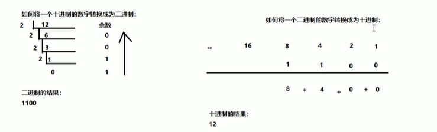
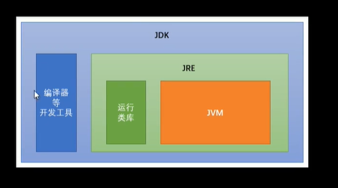

[TOC]

`https://www.bilibili.com/video/BV1T7411m7Ta?p=30`

```
计算机最小存储文字是字节
1Byte = 8 bit
1KB = 1024 byte
1MB = 1024Kb
1GB = 1024MB
1TB = 1024GB
1PB = 1024TB
1Eb = 1024PB
1ZB = 1024EB

```

> 环境变量 JAVA_HOME path %JAVA_HOME%/bin
```
关键字的特点:
    1:完全小写的字母.
    2:在编辑器中有特殊颜色
常量:在程序运行期间,固定不变的量。
    1:字符串常量:凡是用双引号引起来的部分,叫做字符串常量.
    2:整形常量:直接写的数字,没有小数点
    3:浮点数常量:直接写数字,有小数点
    4:字符常量:凡是用单引号引起来的单个字符就是字符常量
    5:布尔常量:true|false
    6:空常量:null
基本数据类型:
    整数型:byte short int long
    浮点型:float double
    字符型:char
    布尔型:boolean
引用数据类型:
    字符串,数组,类,接口,Lambda
变量:程序运行的期间,内容可以发成改变的量.
    1:创建多个变量,变量自建名称不能冲重复
    2:对于float和long来说后面的F和L 不能丢掉
    3:如果使用byte和short类型的变量,右侧的数值不能超过类型的数据范围
    4:没有进行赋值的变量,不能直接使用,一定要赋值才能使用
    5:变量的使用不能超过作用域的范围
    6:可以通过一个语句创建多个变量,一般不推荐
制动类型转换
    1:代码不需要进行特殊处理,自动完成
    2:规则:数据范围从小到大
强制类型转换
    1:代码需要特殊处理,不能自动完成
    2:格式范围小的类型 范围小的变量名 = (范围小的类型) 范围大的数值
注意事项:
    1:强制类型转换一般不推荐使用,因为会精度损失,数据溢出
    2:byte/short/char 这三种类型都可以数学运算
    3:byte/short/char 这三种类型都会先提升int 然后进行运算
    4:boolean 不能进行数据类型转换
数字和字符的对照关系表(编码表):
    ASCII码表:American Standard Code for Information Interchange 美国信息交换标准码
    Unicode:万国码,也是数字和字符的对照关系表 开头0-127部分和ASCII 完全一样 但是从128 开始包含有更多字符
对于byte short char 三种类型来说,如果右侧赋值的数值没有超过范围 那么javac 编译器将会自动隐含的为我们补上(byte),(short)(,(char)(,char)(,char)(,char)(,char)(,char)
    1:如果没有超过范围编译器补上强转
    2:如果超过编译器报错
编译器的常量优化
    1:short a = 5 + 8 ; javac 编译后是 a = 13
三种循环的区别:
    1:如果条件从来没有满足过 ,for while 会执行0 次 do-while 至少循环一次
    2:for循环变量在小括号内 只能循环使用 while 和 do-while 子啊外面出去也能使用
使用方法的时候,注意事项
    1:方法应该定义在类中,不能在方法中定义方法,不能嵌套
    2:方法定义顺序无所谓
    3:方法定义之后不会执行,需要调用,单独调用,打印调用,赋值调用
    4:如果方法返回值,那么必须return 返回值
    5:return后面的返回值数据 必须和方法的返回值类型对应起来
    6:对于void类型的没有返回的方法,不能return 返回值只能return 自己
    7:对于void方法中的最后一行的return可以省略不写
    8:一个方法可以有多个return语句,但是必须保证同时只要一个被执行,两个return 不能连写
数组:
    1:静态初始化没有直接指定长度,但是仍然会自动推算长度.
    2:静态初始化标准格式可以拆分两个步骤
    3:动态初始化也可以拆分两个步骤
    4:静态初始化一旦使用省略模式就不能分为两步
使用建议:
   不确定内容用动态,确定用静态
java的内存划分5个部分
    1:栈(Stack):存放的都是方法中的局部变量 方法的运行都在栈当中
        局部变量:方法的参数或者方法{}内部变量
        作用域:一旦超出作用域,立刻从栈内存中消失
    2:堆(Heap):凡是new 出来的东西,都放在堆中 地址值:16位
    3:方法区(method Area):存储.class相关信息,包含方法信息
    4:本地方法栈(Native method stack):与系统相关
    5:寄存器(pc Register):与cpu相关
字符串特点:
    1:字符串内容不可变[重点]
    2:正是因为字符串不可改变,所以字符串共享使用
    3:字符串效果上就是char[]字符数组,但是底层原理byte[]字节数组
String注意事项
    1.任何对象都能用Object接收
    2.equals方法具有对称性 也就是a.equals(b)和b.equals(a) 效果一样
    3.如果比较双方一个常量一个变量,推荐把字符串常量写在前面
方法从写的注意事项
    1.必须保证父子类方法的名称相同,参数列表也相同
    2.子类方法的返回值小于等于父类的返回值范围
    3.修饰符也是大于等于父类 publid->protected ->(default)->private
抽象方法:就是加上abstract关键字 然后去店大括号直接分号结束
抽象类:抽象方法所在的类必须是抽象类 在class 之前 加上abstract
如何使用抽象类和抽象方法 一个抽象类不一定含有抽象方法 但是抽象方法一定在抽象类中
    1.不能直接创建new 抽象对象
    2.必须用一个子类来继承抽象类
    3.子类必须覆盖从写抽象类中的抽象方法,然后补上方法体大括号
    4.创建子类对象进行使用
在java9+版本中,接口内容可以有
    1.成员变量是常量
        public static final int COUNT = 0; //关键字可以省略
        注意:常量必须赋值,而且一旦赋值不能改变,常量名称完全大写,用下划线分割
    2.接口中最重要的就是抽象方法
        public abstract void method();
        注意:实现类必须重写覆盖所有抽象方法,除非实现也是抽象类
    3.从Java8开始接口允许定义默认方法
        public default void method1(){}
        注意:默认方法可以被覆盖从写
    4.从java8开始接口允许定义静态方法
        注意:应该通过接口名称进行调用
    5.从java9开始接口允许定义私有格式
        普通私有 静态私有
        注意:private 只能接口自己调用,不能被实现类调用
接口的注意事项
    1.接口不能有静态代码块,不能有构造方法
    2.一个类的直接父类唯一,但是可以实现多个接口
    3.如果实现类实现的所有接口中,存在重复的抽象方法,那么只需要覆盖从写一次即可
    4.如果实现类没有覆盖从写抽象方法 那这个实现类就是抽象类
    5.如果实现类实现的所有接口中,存在重复的默认方法,那么实现类一定要对冲突的默认方法进行覆盖从写
    6.一个类直接父类当中的方法和接口当中的方法产生冲突,优先使用父类当中的方法
Java中有四种权限修饰符
        public > protected > default > private
```

|         名称         | public | protected | default | private |
| :------------------: | :----: | :-------: | :-----: | :-----: |
|   同一个类(我自己)   |  yes   |    yes    |   yes   |   yes   |
|   同一个包(我邻居)   |  yes   |    yes    |   yes   |   no    |
|  不同包子类(我儿子)  |  yes   |    yes    |   no    |   no    |
| 不同包非子类(陌生人) |  yes   |    no     |   no    |   no    |
```

```